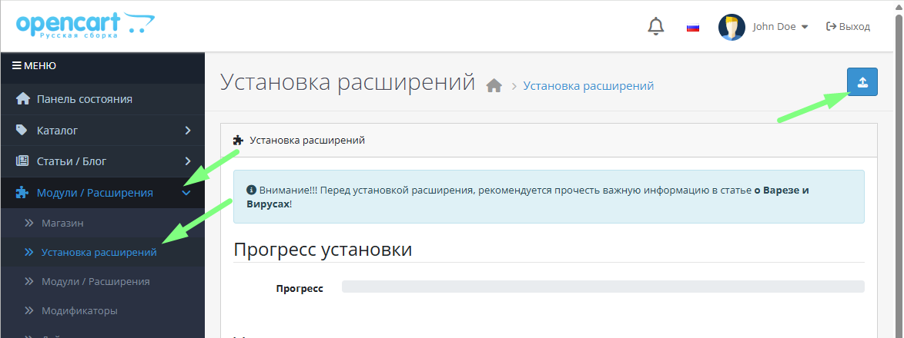
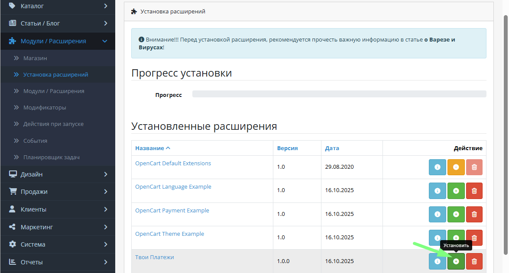
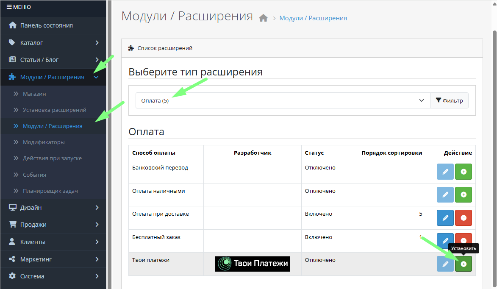
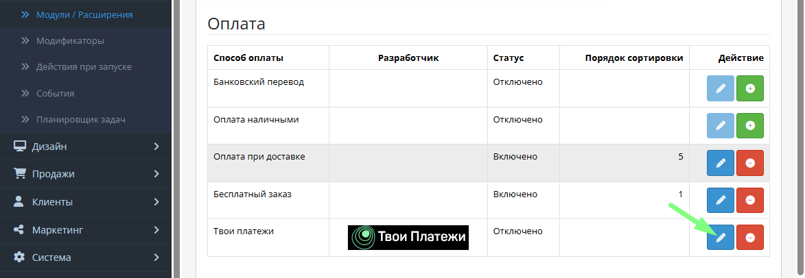
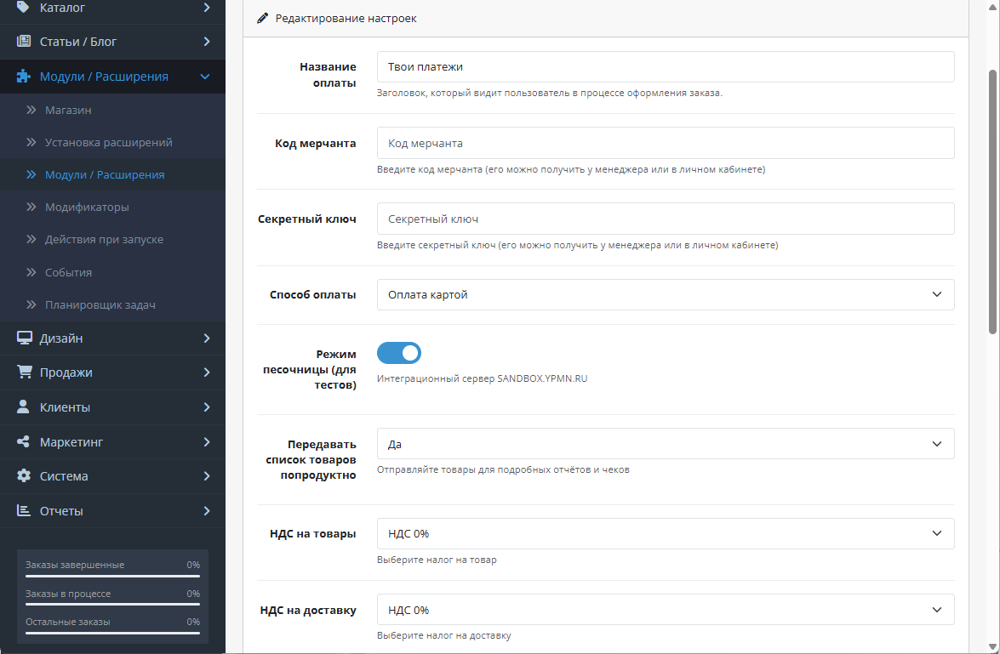
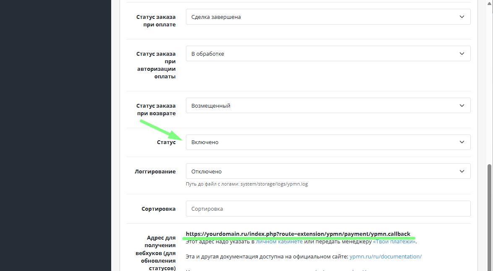
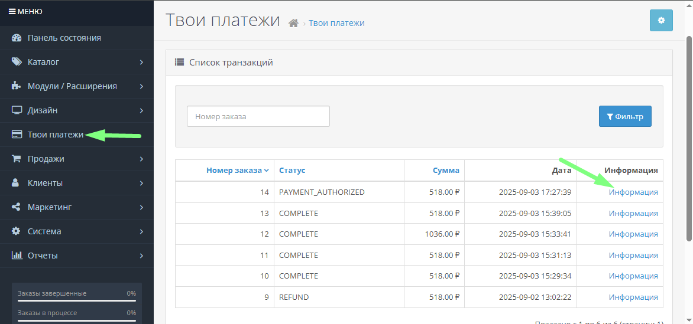
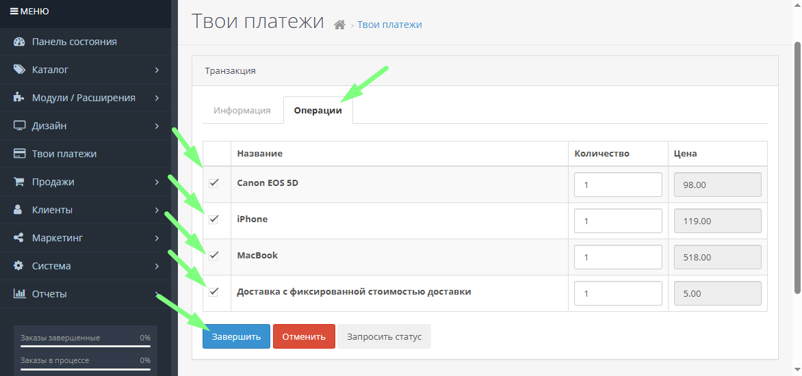
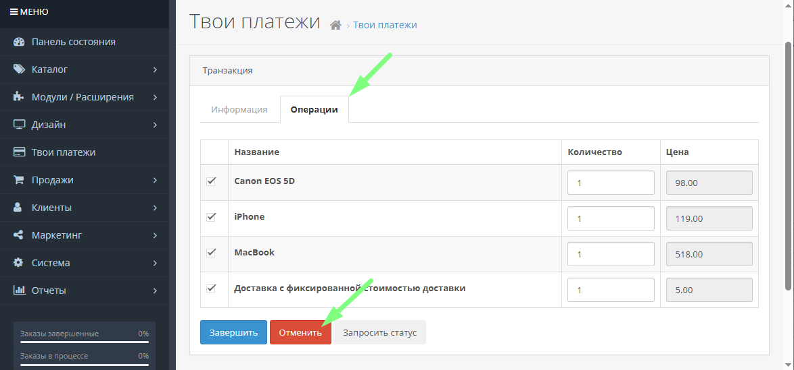
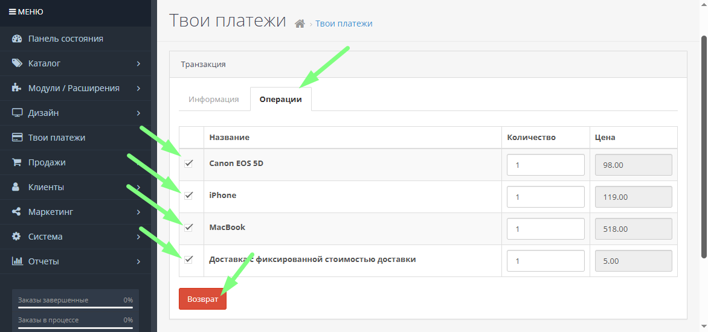

# «Твои платежи», плагин для CMS OpenCart 4

-------------
## Установка

[📥 Скачать ZIP-архив с плагином](dist/) |

1. **[Важно]** Имя файла модуля должно быть строго "ypmn.ocmod.zip"

   Перейдите в раздел Модули / Расширения -> Установка расширений

   Загрузите файл модуля по кнопке “Загрузить”
      
1. После загрузки нажмите кнопку "Установить"
   
1. Перейдите в раздел Модули / Расширения -> Модули / Расширения. Выберите тип расширения "Оплата" и нажмите кнопку "Установить"
   
1. Перейдите в настройки оплаты
   
1. Заполните основные настройки, задайте способ оплаты по умолчанию и статусы заказа для соответствующих статусов платежей, значение "Статус" установите в значение "Включено". Так же в настройках отображается ссылка, которую нужно указать в Личном кабинете "Твои платежи" в настройках IPN уведомлений.
   
   
   Нажмите кнопку "Сохранить" сверху

   После, если всё настроено правильно, можно провести тестовые оплаты и посмотреть транзакции в разделе Твои Платежи
   

## Операции над транзакциями
### Подтверждение оплаты (для двустадийных транзакций с ручным подтверждением списания)
1. Перейдите в раздел Твои платежи.
   
   Выберите нужную транзакцию в статусе PAYMENT_AUTHORIZED, нажав ссылку "Информация"
   
1. Перейдите на вкладку "Операции", выберите позиции в чеке, по которым будет подтверждение списания, и нажмите кнопку “Завершить”
   
1. Дождитесь пока система получит уведомление о том, что подтверждение оплаты произошло, транзакция сменит свой статус на COMPLETE.

### Отмена оплаты (для двустадийных транзакций с ручным подтверждением списания)
Перейдите в раздел Твои платежи. 

Выберите нужную транзакцию в статусе PAYMENT_AUTHORIZED. 
   
Перейдите на вкладку "Операции" и нажмите кнопку “Отменить”

### Возврат
Перейдите в раздел Твои платежи

Выберите нужную транзакцию в статусе COMPLETE

Перейдите на вкладку Операции, выберите список позиций для возврата и нажмите кнопку “Возврат”

-------------

## Ссылки
- [НКО «Твои Платежи»](https://YPMN.ru/)
- [Докуметация API](https://ypmn.ru/ru/documentation/)
- [Тестовые банковские карты](https://ypmn.ru/ru/documentation/#tag/testing)
- [Задать вопрос или сообщить о проблеме](https://ypmn.ru/ru/support/)

🟢 [«Твои Платежи»](https://YPMN.ru/ "Платёжная система для сайтов, платформ и приложений") -- финтех-составляющая для сайтов, платформ и приложений